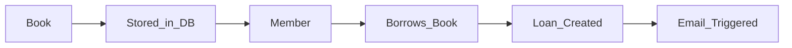
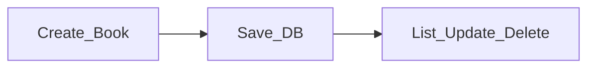
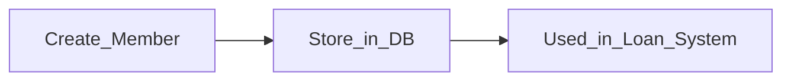
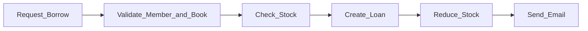
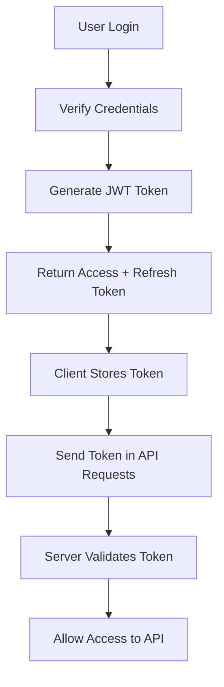
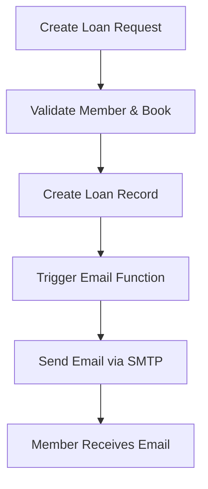

# Library Management API


## What is this API (Core Idea)

This project is a **backend-only system**.

That means:

- It does NOT depend on a web UI
- It can be used by any client:
  - Mobile app (Android / iOS)
  - Web frontend (React / Vue / Angular)
  - Desktop app
  - Postman / other APIs

### API Definition (Important Concept)

An API (Application Programming Interface) is a system that:

- Takes request from client
- Processes data in backend
- Returns response in JSON format

Example flow:

Client (Mobile/Web) → API Request → Django Backend → Database → JSON Response

So backend is **independent of frontend design**.

This is why we say:

> “One backend can power multiple applications.”

---

## What is Django REST Framework (DRF)

DRF is a toolkit that helps build APIs in Django.

It provides:
- Serialization system
- ViewSets (logic handler)
- Routers (auto URL generation)
- Authentication support
- API responses in JSON format

---

## What is a Serializer

Serializer is one of the most important parts of DRF.

### Simple Meaning:

Serializer converts data between:
- Python objects (Database Queryset)
→ JSON format (API response)

and also:
- JSON input (request data)
→ Python object (validated data)

---

### Example Concept:

Database Data:

## Overview

This project is a backend REST API for a library system built using Django and Django REST Framework (DRF).

It manages books, members, and borrowing records with authentication, file uploads, email notifications, and admin panel customization.

---

## System Flow (Simple Understanding)

Member logs in → Gets token → Uses API → Borrows book → Loan created → Email sent → Book stock updated

---

## Tech Stack

- Django
- Django REST Framework
- SimpleJWT (Authentication)
- drf-yasg (API Docs)
- Jazzmin (Admin UI)
- Pillow (Image upload)
- django-filter
- uv (Environment & dependency manager)

---

## Project Setup (Using uv)

### 1. Create Project Environment

```bash id="uv1"
uv init library-api
cd library-api
```
### 2. uv add django djangorestframework

```bash
uv add django djangorestframework
uv add djangorestframework-simplejwt
uv add drf-yasg
uv add django-jazzmin
uv add pillow
uv add django-filter
uv add django-environ
```

### 3. Run django project 
```bash
uv run django-admin startproject config .
uv run python manage.py startapp books
uv run python manage.py startapp members
uv run python manage.py startapp loans
```

### 4. Project Architecture Flow

## Authentication Flow (JWT)

```api
POST /api/token/
POST /api/token/refresh/
```

## Book Module Flow



## Member Module Flow



## Loan (Borrow System) Flow



## File Upload Flow
 Uses Django send_mail + SMTP (Gmail)

 


 ## What is DRF Router (Routing System)

Instead of manually writing URLs, DRF provides routers.

Without Router:

You manually define:
```text
/books/
/books/1/
/books/create/
```
With Router:

```api
router.register('books', BookViewSet)
```

It automatically generates:

```api
GET /books/
POST /books/
GET /books/{id}/
PUT /books/{id}/
DELETE /books/{id}/
```
## Swagger 
It is a tool that automatically shows all your API endpoints in the browser and lets you test them without Postman. It reads your Django REST Framework code and generates interactive documentation where you can see request/response formats and try APIs directly. It provides /swagger/ for interactive testing and /redoc/ for clean documentation, making it easier for frontend and mobile developers to understand and use the backend API.

## Jazzmin (Django Admin Panel Enhancement)

Jazzmin is a package that improves the default Django Admin dashboard by making it more modern, clean, and easy to use.

By default, Django Admin has a simple and basic interface, which can feel hard to navigate. Jazzmin upgrades it with a better UI, improved layout, search features, filters, and an overall professional dashboard design.

## JWT System Flow
In traditional systems:
- Every request needs login check in database

In JWT system:
- User logs in once
- Server gives a token
- That token is used for all future requests




### DRF SimpleJWT Setup
```bash
uv add djangorestframework-simplejwt
```
```py
settings.py configuration:
REST_FRAMEWORK = {
    'DEFAULT_AUTHENTICATION_CLASSES': (
        'rest_framework_simplejwt.authentication.JWTAuthentication',
    )

}
```
 ### urls.py setup:
```py
from rest_framework_simplejwt.views import (
    TokenObtainPairView,
    TokenRefreshView
)

urlpatterns = [
    path('api/token/', TokenObtainPairView.as_view()),
    path('api/token/refresh/', TokenRefreshView.as_view()),
]
```
## Where JWT is Used in This Project

JWT protects:
```text
Create Book (POST)
Update Book (PUT/PATCH)
Delete Book (DELETE)
Borrow Book (Loan API)
Member creation 


```
# Email Notification System

## What is Email System in this Project?

The email system is used to automatically send emails to members when they borrow a book.

It is triggered from the backend when a Loan (borrow record) is created.

---


## Email System Flow



## package
```bash
uv add django-environ
```
## Email Configuration in settings.py
```py
EMAIL_BACKEND = 'django.core.mail.backends.smtp.EmailBackend'
EMAIL_HOST = 'smtp.gmail.com'
EMAIL_PORT = 587
EMAIL_USE_TLS = True

EMAIL_HOST_USER = config('EMAIL_HOST_USER')
EMAIL_HOST_PASSWORD = config('EMAIL_HOST_PASSWORD')
```
## Environment Variables (.env)
```py
EMAIL_HOST_USER=your_email@gmail.com
EMAIL_HOST_PASSWORD=your_app_password
```

## ⚠️ Important Note (Gmail Setup) 

If you are using Gmail:
``` text

Enable 2-Step Verification
Generate an App Password
Use App Password instead of your normal Gmail password

```


